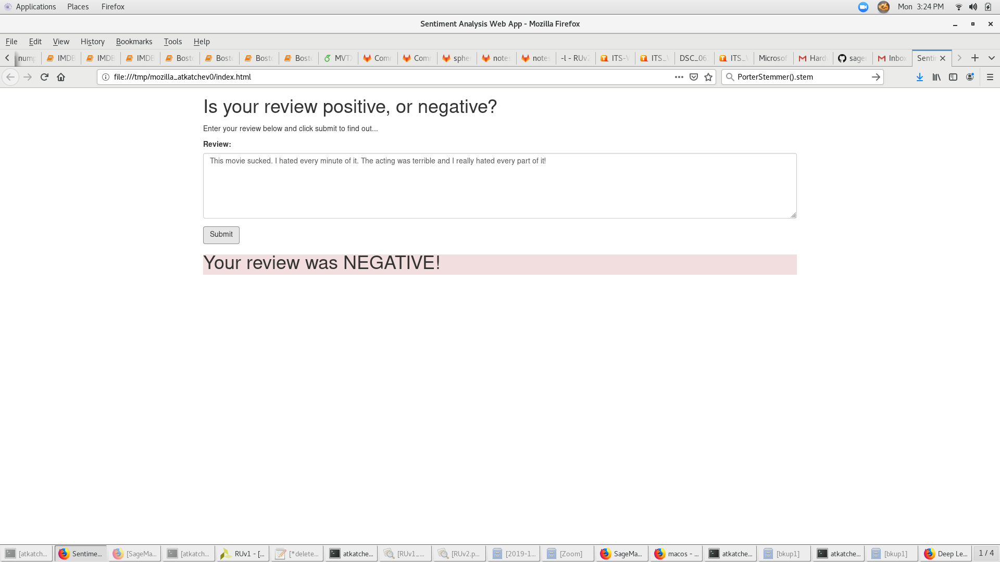

# SageMaker Deployment Project Overview

The SageMaker Deployment project is the fifth project of the Udacity Deep Learning Nano Degree. The project uses Amazon Sagemaker as the back-end and simple web app which interacts with a deployed recurrent neural network performing sentiment analysis on movie reviews. XGBoost is used as the machine learning algorithm.

## Instruction 

Please see the [README](https://github.com/udacity/sagemaker-deployment/tree/master/README.md) in the root directory for instructions on setting up a SageMaker notebook and downloading the project files.
1. Clone the repository
```console
git clone https://github.com/atkatchev/DLND_Project5_AWS
```
2. Open the SageMaker Project file using jupyter notebook. Otherwise, open .html page
```console
jupyter notebook SageMaker Project.ipynb
```

## Project Information 

- Dataset: [IMDb dataset](http://ai.stanford.edu/~amaas/data/sentiment/) 
- Create AWS SageMAker Notebook Instance and download the dataset
- Prepare and Processing the data, upload the data to S3
- Define, build and Train the RNN model implemented in PyTorch using a Sagemaker instance
- Create an endpoint to the model 
- Create a Lambda function to pass data to the model for inference
- Create an API Gateway that binds to the Lambda function
- Data is passed through the API Gateway for inference
- The response would be recieved on a mobile or web app. 

## Libraries

The list below represents main libraries and its objects for the project.

- [Amazon SageMaker](https://docs.aws.amazon.com/sagemaker/latest/dg/) (Build, train, and deploy a model)
- [PyTorch](https://pytorch.org/) (LSTM classifier)

## Delete the Endpoint

Remember to always SHUT DOWN YOUR ENDPOINT if you are no longer using it. You are charged for the length of time that the endpoint is running so if you forget and leave it on you could end up with an unexpectedly large bill.
```console
    predictor.delete_endpoint()
```

## Web app final result
You will see the following:


