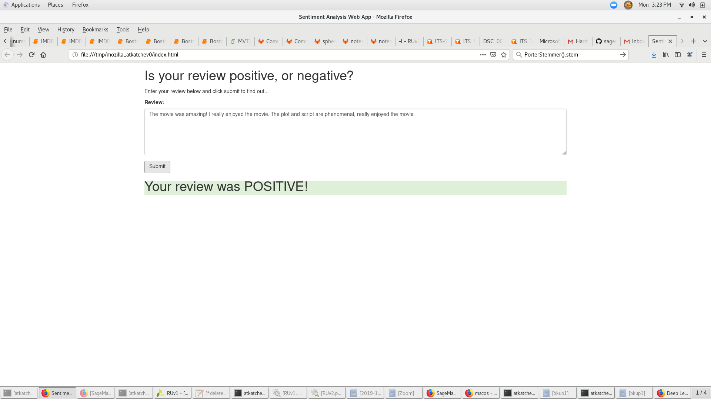

# SageMaker Deployment Project Overview

The [AWS SageMaker](https://aws.amazon.com/sagemaker/) Deployment project is the fifth project of the Udacity Deep Learning Nano Degree. 

The project uses Amazon Sagemaker to deploy a Recurrent Neural Network (RNN) performing sentiment analysis on movie reviews complete with publicly accessible API and a simple web page which interacts with the deployed endpoint. [XGBoost](https://xgboost.readthedocs.io/en/latest/) is used as the machine learning algorithm.

## Setup Instructions

The notebooks provided in this repository are intended to be executed using Amazon's SageMaker platform. The following is a brief set of instructions on setting up a managed notebook instance using SageMaker, from which the notebooks can be completed and run.

### Log in to the AWS console and create a notebook instance

Log in to the AWS console and go to the SageMaker dashboard. Click on 'Create notebook instance'. The notebook name can be anything and using ml.t2.medium is a good idea as it is covered under the free tier. For the role, creating a new role works fine. Using the default options is also okay. Important to note that you need the notebook instance to have access to S3 resources, which it does by default. In particular, any S3 bucket or objectt with sagemaker in the name is available to the notebook.

### Use git to clone the repository into the notebook instance

Once the instance has been started and is accessible, click on 'open' to get the Jupyter notebook main page. We will begin by cloning the SageMaker Deployment github repository into the notebook instance. Note that we want to make sure to clone this into the appropriate directory so that the data will be preserved between sessions.

Click on the 'new' dropdown menu and select 'terminal'. By default, the working directory of the terminal instance is the home directory, however, the Jupyter notebook hub's root directory is under 'SageMaker'. Enter the appropriate directory and clone the repository as follows.

```bash
cd SageMaker
git clone https://github.com/atkatchev/deploying-sentiment-analysis-model
exit
```

After you have finished, close the terminal window.

### Open and run the notebook of your choice

Now that the repository has been cloned into the notebook instance you may navigate to any of the notebooks that you wish to complete or execute and work with them. Any additional instructions are contained in their respective notebooks.

## Project Information 

- Dataset: [IMDb dataset](http://ai.stanford.edu/~amaas/data/sentiment/) 
- Create AWS SageMAker Notebook Instance and download the dataset
- Prepare and Processing the data, upload the data to S3
- Define, build and Train the RNN model implemented in PyTorch using a Sagemaker instance
- Create an endpoint to the model 
- Create a Lambda function to pass data to the model for inference
- Create an API Gateway that binds to the Lambda function
- Data is passed through the API Gateway for inference
- The response would be recieved on a mobile or web app. 
- For additional information please see [README](https://github.com/udacity/sagemaker-deployment/tree/master/README.md)

## Libraries

The list below represents main libraries and its objects for the project.

- [Amazon SageMaker](https://docs.aws.amazon.com/sagemaker/latest/dg/) (Build, train, and deploy a model)
- [PyTorch](https://pytorch.org/) (LSTM classifier)

## Delete the Endpoint

Remember to always SHUT DOWN YOUR ENDPOINT if you are no longer using it. You are charged for the length of time that the endpoint is running so if you forget and leave it on you could end up with an unexpectedly large bill.
```console
    predictor.delete_endpoint()
```

## Web app final result
You will see the following:


